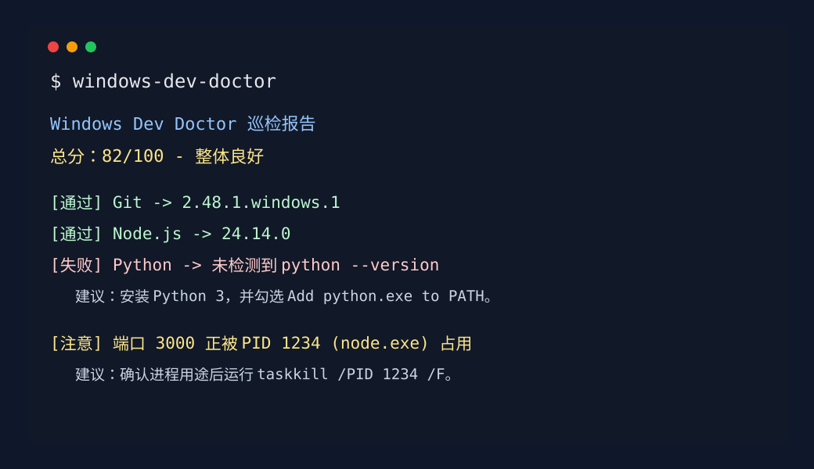

# Windows Dev Doctor

[](https://github.com/yunxi067/windows-dev-doctor/actions/workflows/test.yml)
[](https://www.npmjs.com/package/@yunxi067/windows-dev-doctor)
[](./LICENSE)

Windows Dev Doctor 是一个中文命令行巡检工具，用来快速检查 Windows 开发环境是否健康。它会检查 Git、Node.js、npm、Python、Java、Docker、WSL、包管理器、构建工具、环境变量、镜像源和常见开发端口，并给出清晰的中文修复建议。



## 功能亮点

- 检查常用开发工具：Git、Node.js、npm、Python、Python Launcher、Java、Docker CLI、Docker Engine、WSL、pnpm、Yarn、Maven、Gradle。
- 检查环境变量：PATH、重复 PATH、失效 PATH 目录、TEMP、TMP、JAVA_HOME、代理变量。
- 检查开发配置：PowerShell 执行策略、npm registry、pip index-url。
- 检查端口占用：默认覆盖 80、443、3000、3306、5432、5173、6379、8000、8080、9000、27017。
- 输出中文报告：每个问题都有具体原因和修复建议。
- 支持 JSON、隐私脱敏和修复计划输出：方便接入脚本、CI、自动化巡检或后续做桌面版。
- 零运行时依赖：只使用 Node.js 标准库。

## 安装

使用 npx 直接运行：

```bash
npx @yunxi067/windows-dev-doctor
```

从仓库运行：

```bash
git clone https://github.com/yunxi067/windows-dev-doctor.git
cd windows-dev-doctor
npm install
```

也可以直接使用 Node 运行源码：

```bash
node src/cli.js
```

## 使用

输出中文文本报告：

```bash
npx @yunxi067/windows-dev-doctor
```

输出 JSON：

```bash
npx @yunxi067/windows-dev-doctor --json
```

从源码运行时隐藏用户名和用户目录路径：

```bash
node src/cli.js --privacy
```

从源码运行时只输出修复建议清单：

```bash
node src/cli.js --fix-plan
```

指定要检查的端口：

```bash
npx @yunxi067/windows-dev-doctor --ports=3000,5173,8080,3306
```

查看帮助：

```bash
node src/cli.js --help
```

## 巡检内容

### 工具链

| 工具 | 检查方式 | 常见建议 |
| --- | --- | --- |
| Git | `git --version` | 安装 Git for Windows，并重新打开终端 |
| Node.js | `node --version` | 安装 Node.js LTS，或使用 nvm-windows 管理版本 |
| npm | `npm --version` | 重新安装 Node.js，或修复 npm PATH |
| Python | `python --version` | 安装 Python 3，并勾选 Add python.exe to PATH |
| Python Launcher | `py --version` | 安装 Python Launcher |
| Java | `java -version` | 安装 JDK 17/21，配置 JAVA_HOME |
| Docker CLI | `docker --version` | 安装 Docker Desktop |
| Docker Engine | `docker info` | 启动 Docker Desktop，并等待引擎就绪 |
| WSL | `wsl --status` | 如需 Linux 开发环境，启用 WSL2 |
| pnpm | `pnpm --version` | 使用 Corepack 启用 pnpm |
| Yarn | `yarn --version` | 使用 Corepack 启用 Yarn |
| Maven | `mvn --version` | 安装 Maven 并加入 PATH |
| Gradle | `gradle --version` | 安装 Gradle 或使用项目自带 `gradlew` |

### 环境变量

Windows Dev Doctor 会检查：

- PATH 是否存在
- PATH 是否有重复目录
- PATH 是否包含不存在的目录
- TEMP/TMP 是否配置
- JAVA_HOME 是否配置
- HTTP_PROXY/HTTPS_PROXY 是否可能影响网络命令

### 配置检查

Windows Dev Doctor 会检查：

- PowerShell 当前用户执行策略是否可能阻止 npm/pnpm 脚本
- npm registry 是否可读取
- pip index-url 是否配置

### 端口占用

在 Windows 上会调用：

```bash
netstat -ano
tasklist
```

然后把端口、PID 和进程名关联起来。例如如果 3000 被 `node.exe` 占用，报告会提示对应 PID，并给出 `taskkill` 建议。

## 示例报告

查看 [docs/example-report.md](./docs/example-report.md)。

## JSON 输出结构

`--json` 会输出类似结构：

```json
{
  "generatedAt": "2026-06-06T00:00:00.000Z",
  "platform": "win32",
  "summary": {
    "score": 82,
    "level": "good",
    "title": "整体良好"
  },
  "sections": [
    {
      "title": "工具链",
      "items": []
    }
  ]
}
```

## 评分规则

- `pass` 计 1 分
- `warn` 计三分之一分
- `fail` 计 0 分

最终分数会映射为：

- 90-100：状态优秀
- 75-89：整体良好
- 60-74：需要关注
- 0-59：问题较多

## 常见问题

### 它会修改我的系统吗？

不会。Windows Dev Doctor 只读取命令输出和环境变量，不会安装软件、修改 PATH、停止进程或写系统配置。

### 为什么 Docker Engine 是注意而不是失败？

很多机器安装了 Docker CLI，但 Docker Desktop 没启动。这个情况会影响开发，但通常不是工具缺失，所以标为“注意”。

### 为什么 WSL、pnpm、Yarn、Maven、Gradle 缺失只是注意？

这些工具取决于你的技术栈，不是每个 Windows 开发环境都必须安装。工具会提醒和给建议，但不会把它们当作基础环境失败项。

### 为什么端口占用不是失败？

端口被占用不一定是错误，可能是你的开发服务正在运行。工具只提醒你“这个端口已经有人用了”。

### `--privacy` 会隐藏什么？

它会隐藏报告中的 Windows 用户名、`C:\Users\<用户名>` 和 `/Users/<用户名>` 这类本地用户目录，方便你把报告贴到 issue 或群里求助。

### 可以在 macOS 或 Linux 上运行吗？

核心工具检查可以运行，但端口巡检目前面向 Windows 的 `netstat -ano` 和 `tasklist`，非 Windows 平台会提示跳过端口精确检测。

## 开发

```bash
npm install
npm test
node src/cli.js
node src/cli.js --json
node src/cli.js --privacy --fix-plan
```

## 参与贡献

欢迎提交 issue 或 pull request。请查看 [CONTRIBUTING.md](./CONTRIBUTING.md)。

## 版本记录

查看 [CHANGELOG.md](./CHANGELOG.md)。

## License

MIT
